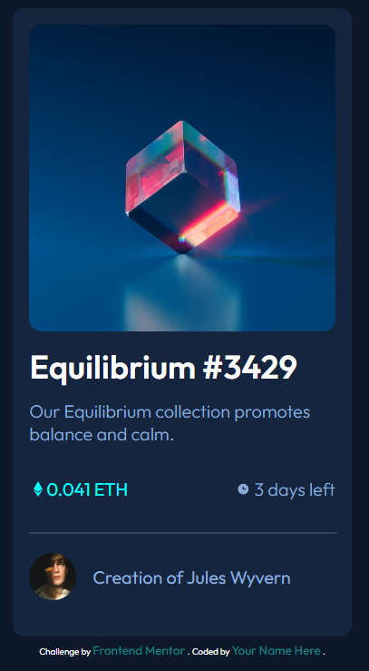

# Frontend Mentor - NFT preview card component solution

This is a solution to the [NFT preview card component challenge on Frontend Mentor](https://www.frontendmentor.io/challenges/nft-preview-card-component-SbdUL_w0U). Frontend Mentor challenges help you improve your coding skills by building realistic projects.

## Table of contents

- [Overview](#overview)
  - [The challenge](#the-challenge)
  - [Screenshot](#screenshot)
  - [Links](#links)
- [My process](#my-process)
  - [Built with](#built-with)
- [Author](#author)

## Overview

### The challenge

Users should be able to:

- View the optimal layout depending on their device's screen size
- See hover states for interactive elements

### Screenshot

### Links

- Solution URL: [This very repo](https://github.com/WebDevCampos/FrontEndMentor/tree/main/NFT%20Component)
- Live Site URL: [Hosted by Netlify](https://nftfementor.netlify.app/)

## My process

### Built with

- Semantic HTML5 markup
- CSS custom properties
- Flexbox

## Author

- Frontend Mentor - [@WebDevCampos](https://www.frontendmentor.io/profile/WebDevCampos)
- Github - [Marcus Rangel](https://github.com/WebDevCampos)
- Linkedin - [Marcus Rangel](https://www.linkedin.com/in/marcus-rangel-webdev/)
- Codepen - [@webdevcampos](https://codepen.io/webdevcampos)
- Discord - [Ghostdancing#3983](https://discord.com/)
